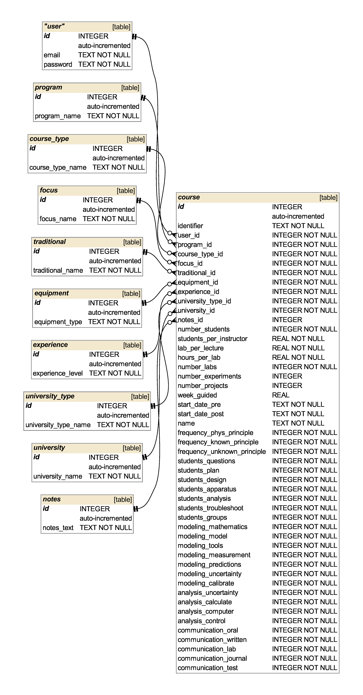
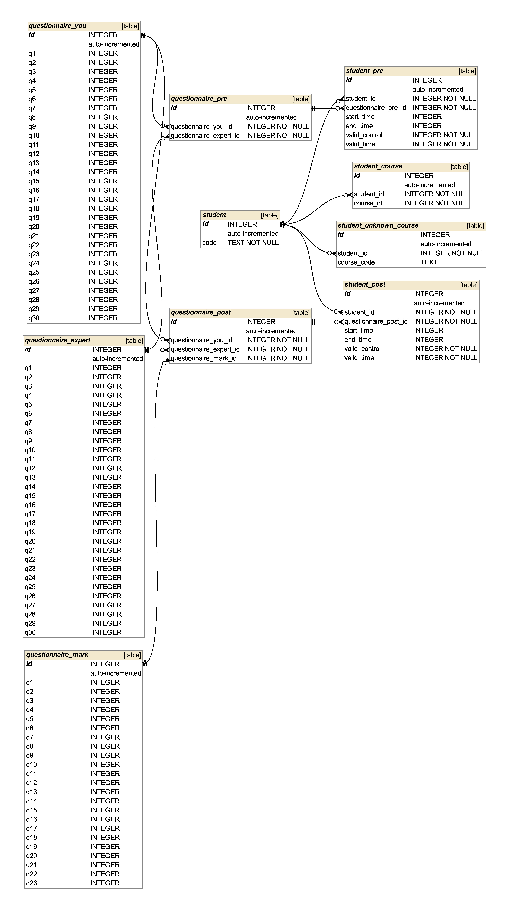

Database
********

Webpage
=======

The database for the webpage is a simple SQLite relational database. Since there
is not a huge amount of users, this should be enough. If there should be a
time when it will not be enough, then the transition to e.g. MySQL should be
rather painless.

This is the structure:

* user

  * id - the primary key (autoincrements)
  * email - the email of the user, stored as a string
  * password - the password hash as a string

* course

  * id - the primary key (autoincrement)
  * user_id - the id of the user the course belongs to
  * program_id - the id of the program the students belong to
  * course_type_id
  * focus_id
  * traditional_id
  * equipment_id
  * experience_id
  * university_type_id
  * university_id
  * notes_id
  * number_students - expected total number of students
  * students_per_instructor - average of students per instructor
  * lab_per_lecture - ratio of lab time to lecture time
  * horus_per_lab - length of one lab in hours
  * number_labs - number of total labs
  * number_experiments - number of experiments
  * number_projects - number of projects
  * week_guided - how many weeks are guided
  * start_date_pre - start date of pre questionaire
  * start_date_post - start date of post questionaire
  * name - name of the course
  * frequency_phys_principle - frequency of verifying known physical principles
  * frequency_known_principle - frequency of finding known physical principles
  * frequency_unknown_principle - frequency of finding unknown physical principles
  * students_questions - student agency in posing question
  * students_plan - student agency in planing experiment
  * students_design - student agency in designing the experiment
  * students_apparatus - student agency in building the apparatus
  * students_analysis - student agency in analysis of results
  * students_troubleshoot - student agency in troubleshooting the experiment
  * students_groups - student agency of working in groups
  * modeling_mathematics - student agency in mathematical modeling of the system
  * modeling_model - student agency in conecptually modeling the system
  * modeling_tools - student agency in modeling the tools
  * modeling_measurement - student agency in modeling the measurement system
  * modeling_predictions - student agency in making predictions from models
  * modeling_uncertainty - student agency in reducing the uncertainty
  * modeling_calibrate - student agency in calibrating the tools
  * analysis_uncertainty - analysis by calculating the uncertainty
  * analysis_calculate - analysis by calculating error propagation
  * analysis_computer - analysis by using the computer
  * analysis_control - analysis by controling the tools with a computer
  * communication_oral - communicate results with an oral presentation
  * communication_written - communicate results with a written presentation
  * communication_lab - communication with a labbook
  * communication_journal - communication with a journal article
  * communication_test - communication preparation with anoral exam

* program

  * id - the primary key (autoincrement)
  * program_name - name of the program

* course_type

  * id - the primary key (autoincrement)
  * course_type_name - name of the type of course (GP/FP)

* focus

  * id - the primary key (autoincrement)
  * focus_name - what the course focuses on

* traditional

  * id - the primary key (autoincrement)
  * traditional_name - if the course is traditional, nontraditional

* equipment

  * id - the primary key (autoincrement)
  * equipment_type - typical type of equipment in lab

* experience

  * id - the primary key (autoincrement)
  * experience_level - level of experience (first-year/second-year)

* university

  * id - the primary key (autoincrement)
  * university_name - name of the university

* notes

  * id - the primary key (autoincrement)
  * notes_text - notes about the course

* university_type

  * id - the primary key (autoincrement)
  * university_type_name - the type of university (eg. Hochschule,
    Fachhochschule)

Questionnaire
=============

The results of the questionnaire are also stored in an SQLite database. It is
called `questionnaire.sqlite`.

The tables `questionnaire_you`, `questionnaire_expert` and `questionnaire_mark`
contain the answers given by one student on one occasion. They are combined in
the `questionnaire_pre` and `questionnaire_post` tables to represent one
questionnaire response by one student.

In `student` every single student is represented by a row, but the field `code`
is not unique. In the processing before the insertion students will be
identified by their code and their course. The corresponding course for a
student can be found by cross referencing the `course_id` field in the
`student_course` table. Should the given course be unknown, i.e., a wrong course
code has been given, then the students id and the course code are saved in
`student_unknown_course` to allow for a manual post processing of the responses.

Finally the questionnaire responses and some meta data, such as the validity of
the results, and the student who gave the answers is saved in `student_pre` and
`student_post`.
